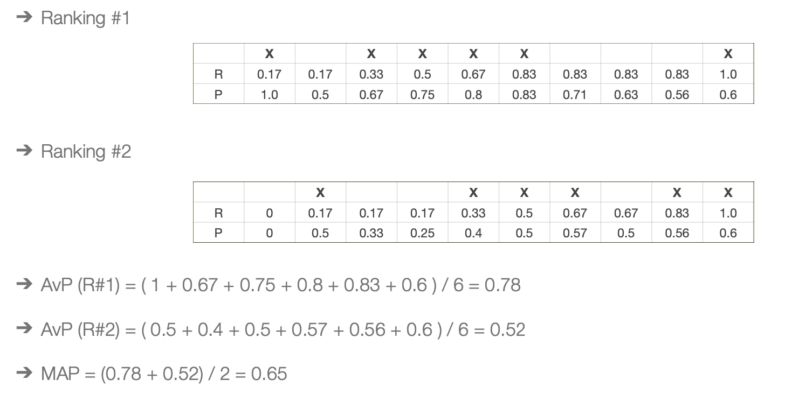

# Information Retrieval

Forma de encontrar e extrair informação relevante de grandes coleções de dados naturalmente não estruturados, como textos. A pesquisa é feita com base em documentos (resultado da reestruturação dos dados iniciais). Não confundir com bases de dados: aqui os resultados são ordenados por relevância, e esse é o principal desafio.

## NPL

O processamento de linguagem natural pode e deve ser usado para Information Retrieval, embora seja desafiante porque a linguagem é ambígua. Extrai informação estruturada para melhor compreensão, extrai também relações, entidades e sentimentos. Conceitos principais:

- `Tokenization`: partir o texto em palavras ou tokens com significado individual;
- `Part-of-Speach (POS) tagging`: dar assign aos tokens, com base em dados gramáticos (verbo, adjectivo);
- `Named Entity Recognition (NER)`: para identificação de entidades como nomes ou lugares; 
- `Syntatic Analysis`: dar parse das frases para entender partes semânticas;
- `Stemming and Lemmatization`: redução das palavras ao seu root (jumping, jump) e redução das palavras à sua base (better, good);
- `Semantic Analysis`: explora o contexto;
- `Sentiment Analysis`: explora os sentimentos com base nas palavras. Classifica-os como positivo, negativo ou neutro;
- `Information extraction`: identifica uma informação estruturada com relações entre tokens;

Pode também ser usada para vários fins:

- **Rule-Based**: usados para identificar entidades, como emails;
- **Statistical**: para prever a próxima palavra de um texto;
- **Machine Learning**: para análise de sentimentos;
- **Deep Learning**: para tradução de textos com base em transformers;

#### Representação textual

- Baseada pela frequência: Bag of Words (BOW), TF-IDF, N-grams (sequências de N tokens contínuos);
- Baseada pela representação semântica: Word Embeddings (king - man + woman = queen), Document Embeddings, Topic Models;
- Baseada pela estrutura: Syntax-Based Representations, Graph-Based Representations;

## Apache Solr

Plataforma de pesquisa de código aberto escrita em Java, escalável, que serve para retornar conteúdos ordenados por relevância. Interage-se com o sistema com base em REST API HTTP, com respostas em JSON ou XML.

### Lucene

Biblioteca escrita em Java que contém os blocos fundamentais para implementar capacidades de searching, indexing e ranking, através de um querying parsing.

### Solr

Uma search engine que usa Lucene e está preparado para um deploy em servidores de larga escala e com grandes volumes de dados. Possui uma interface e pesquisas com:
- faceting;
- highlighting;
- autocomplete

#### Solr Key Concepts

- A informação mais básica de Solr é o `document`;
- Cada document é coposto por `fields`, e cada um tem um tipo específico (date, currency, text, uuid...). Os tipos e definições são declarados em **schema file**;
- Os `textual fields` são tratados numa pipeline com três processos:
    1. `Analysers`: gera um token stream a partir do texto inicial. Contêm duas partes principais: os tokenizers e os filters;
    2. `Tokenizers`: recebe um character stream e retorna uma sequência de token objects;
    3. `Filters`: examina os tokens recebidos e transforma, descarta, deixa, cria novos;
- Pode ter vários `cors`/`indexes`, que guardam a informação dos documentos indexados;
- Suporta REST API para indexes e para queries;
- Os `query parsers` convertem uma string de pesquisa numa query em Lucene e encontra os documentos selecionados;

#### Setup and run

- Colocar o Apache Solr a correr usando o Docker:

```bash
$ docker run --name <PROJECT_NAME> -d -p 8983:8983 solr
```

- Criar um novo `core` para agrupar informação sobre os futuros documentos a indexar:

```bash
$ docker exec <PROJECT_NAME> solr create_core -c <CORE_NAME>
```

- Deste modo, os documentos a inserir no seguinte passo podem ser indexados sem definições extra (*schemaless mode*). A inserção é feita através de um pedido POST:

```bash
$ curl -X POST -H 'Content-type:application/json' \ --data-binary "@./<FILE>.json" \ http://localhost:8983/solr/<PROJECT_NAME>/update\?commit\=true
```

#### Queries

Ou usando diretamente o `Solr Admin`, ou então através de requests:

```bash
$ curl http://localhost:8983/solr/<PROJECT_NAME>/query -d '{ "query": "content:portugal"}'
$ curl 'http://localhost:8983/solr/<PROJECT_NAME>/select?q=*&fl=id,title' # retorna apenas o ID e o TITLE
```

Uma das limitações de `schemaless` é que os acentos importam.

#### Schemas

Há três tipos não-primitivos que podem ser definidos:
- `Fields`: título de um campo de texto e contexto desse campo;
- `dynamicFields`: para indexar campos que não estão explícitos no schema, mas que podem ser pesquisados com base em patterns. Por exemplo, definir um novo field para todos os fields que acabem em "_txt";
- `copyFields`: copiam automaticamente o conteúdo de um field para outro. Usados para remover pontuação nas queries mas deixar o field original para visualização;

A estrutura do schema pode ser loaded usando o comando:

```bash
$ curl -X POST -H 'Content-type:application/json' \ --data-binary "@./<FILE>.json" \ http://localhost:8983/solr/<PROJECT_NAME>/schema
```

Para definir um novo schema, o anterior deve ser eliminado. E só depois há o load dos documentos a consultar. Um exemplo de ficheiro de configuração do schema:

```json
{
    "add-field-type": [
        {
        "name":"newsContent",
        "class":"solr.TextField"
        }
    ],

    "add-field": [
        {
        "name": "content",
        "type": "newsContent",
        "indexed": true
        }
    ] 
}
```

Para cada field, há possibilidade de adicionar informações sobre o `indexAnalyser` e o `queryAnalyser`. Cada analyser pode conter um só `tokenizer` e vários `filters`.

```json
{
    "add-field-type": [
        {
            "name":"newsContent",
            "class":"solr.TextField",
            "indexAnalyzer": {
                "tokenizer": {
                    "class":"solr.StandardTokenizerFactory"
                },
                "filters": [
                    {"class":"solr.ASCIIFoldingFilterFactory", "preserveOriginal":true},
                    {"class":"solr.LowerCaseFilterFactory"},
                ],
            },
            "queryAnalyzer": {
                "tokenizer": {
                    "class":"solr.StandardTokenizerFactory"
                },
                "filters":[
                    {"class":"solr.ASCIIFoldingFilterFactory", "preserveOriginal":true},
                    {"class":"solr.LowerCaseFilterFactory"}
                ],
            }
        }
    ]
}
```

Os `tokenizers` vão quebrar o texto numa stream de tokens de acordo com uma regra. Há uma grande lista de possíveis a usar no projecto, ver [aqui](https://solr.apache.org/guide/solr/latest/indexing-guide/tokenizers.html). Alguns exemplos:
- Standard, usa white spaces e pontuação;
- Lower case, limita non-letters e coverte todas depois para lowercase. White spaces e non-letters são descartados;
- N-Gram, gera streams com N tokens. Bom para pesquisa contextual;

Os `filters` processam a stream de tokens e gera um conjunto diferente de tokens, com base em transformações, eliminações e afins. Há [uma grande lista](https://solr.apache.org/guide/solr/latest/indexing-guide/filters.html) de filtros disponívels para Solr. Exemplos:
- ASCII Folding: converte tudo no seu equivalente ASCII code;
- Lowercase: converte qualquer caracter não-lowercase em lowercase;
- Stop: descarta qualquer token que possua palavras de stop. Podem ser indicadas num ficheiro;
- Snowball Porter Stemmer: aplica patterns com base numa linguagem específica;

#### Parsers

- `Standard`, é o mais simples mas também intolerante em erros de sintaxe;
- `DisMax`, permite cometer alguns erros, apropriado para aplicações gerais;
- `eDisMax`, ou extended DisMax, pois também permite queries mais complexas;

Com **eDisMax** podemos simplesmente:

```note
defType=edismax&qf=title+content+summary&q=flower
````

em vez de 

```note
q=title:flower+AND+content:flower+AND+summary:flower
```

#### Pesos

Também dá para atribuir pesos aos atributos a pesquisar:

```note
qf=title^5+content+summary^3
```

## Evaluation

A avaliação é o coração da **Information Retrieval** e depende da tarefa, da coleção (news articles, web pages, scientific articles) e do tipo de informação necessária. É importante para entender o uso do sistema por parte dos utilizadores e definir novos designs e implementações com base no feedback recebido. 

### Not Ranked

É importante distinguir duas coisas da satisfação dos utilizadores:

- `Eficácia`: medida da habilidade do sistema encontrar a informação certa;
- `Eficiência`: medida da habilidade do sistema encontrar informação rapidamente;

Em termos de eficácia, a avaliação passa por identificar um conjunto de documentos, classificá-los em relevantes ou não e depois recorrer à percentagem retornada pelo sistema de busca.

#### Paradigma de Cranfield

Proporcionou o fundamento para as avaliações atuais de sistemas de informação e culmina no cálculo de valores de Precision e Recal, que são baseados em conjuntos:

- `Precision`: Número de documentos relevantes retirados / Número total de documentos retirados;
- `Recall`: Número de documentos relevantes retirados / Número de documentos relevantes do sistema;
- `Accuracy`: true (positives | negatives) / total;
- `F Measure`: calculado com base em valores de recall e de precision;

### Ranked

#### Precision Recall Curves

Para cada subconjunto de documentos rankeados retornados, e para cada sequência de documentos nesse subconjunto, calcular valores de (recall, precision) para desenhar a curva.

#### Precision at K (P@K)

No caso da WEB, a maioria dos utilizadores não precisa de grande recall, ou seja, não interessa a percentagem de resultados relevantes dado todos os documentos importantes, mas sim a quantidade de documentos relevantes naquele conjunto retornado. Assim, a precisão toma uma importante função e é necessário escolher a quantidade K adequada para que a precisão seja máxima.

#### Mean Average Precision (MAP)

É uma das mais comuns medidas usadas em IR. Trata-se da média de Average Precision dos vários conjuntos retornados, calculados para K documentos rankeados e úteis.



### Eficiência

A eficiência pode ser medida através de:

- Tempo de indexação;
- Latência de pesquisas;
- Tamanho do índex criado;

## IR Overview

### Boolean Model

Uma matriz de incidência é simplesmente um modo de representação que indica se o termo da linha X está presente no documento da coluna Y. Este `Boolean Retrieval Model`:
- vê documentos como um conjunto de palavras;
- tem a facilidade de poder fazer operações bitwise;
- pode ser considerado um BOW (*Bag of Words*) se for considerado também o número de ocorrências;

### Inverted Index

Cada palavra é ligada a uma lista de listas, cada uma podendo conter até 3 argumentos:
- `A`: O index do documento onde a palavra está presente;
- `B`: A quantidade de vezes onde essa palavra está presente naquele documento;
- `C`: Os indexes, naquele documento, da posição de cada match encontrado;

### Parametric and Zone indexes

Há documentos constituídos por mais parâmetros (como data, autores, título) e por isso houve necessidade de criar:
- `parametric indexes`: inverted indexes criados por cada parâmetro. assim conseguimos obter queries mais complexas, como por exemplo "todos os documentos do autor Z que contêm a palavra Y";
- `zone indexes`: é o mesmo conceito, mas aplicado a uma porção arbitrária do documento, como por exemplo ao abstract ou à conclusão de um paper;

## Ranking Retrieval

Num sistema grande o modelo booleano não é a melhor opção e houve necessidade de ordenar os documentos por ordem de relevância. Essa relevância pode, por exemplo, ser o resultado da média ponderada de matches em cada zona ou field. <br> 
O próximo passo da evolução do sistema é não considerar apenas a presença do token mas sim a sua frequência:

- `Term Frequency` (TF) - analisa a frequência num determinado documento. Só isto não é suficiente pois, por exemplo, num conjunto de documentos que são dissertações, a palavra "dissertação" não vai ter relevância para a pesquisa mas vai aparecer muitas vezes;

- `Document Frequency` (DF) - o número de documentos que contêm o termo;

- `Inverse Document Frequency` (IDF) - calculado com log(N / document frequency), sendo N o número total de documentos. Assim, quanto mais raro é o termo nos documentos em geral, maior será este índice;

### TF-IDF

Resulta da multiplicação de TF (a frequência de um dado termo num documento) com IDF (o inverso da frequência desse termo nos documentos em geral). Assim é de prever que:
- o valor será grande para um termo T que apareça muitas vezes num documento e num pequeno número de documentos;
- o valor será pequeno para um termo T que apareça poucas vezes num documento ou que apareça em muitos documentos;
- praticamente nulo se o termo T aparecer em todos os documentos;

## IR Models

Os modelos têm o objectivo de produzir uma **função de ranking**, ou seja, dar score a cada documento dado uma query. Assim, é necessário:
- Representar os documentos, Di;
- Representar as queries, Qi;
- Representar a função de ranking, R(Di, Qi);

